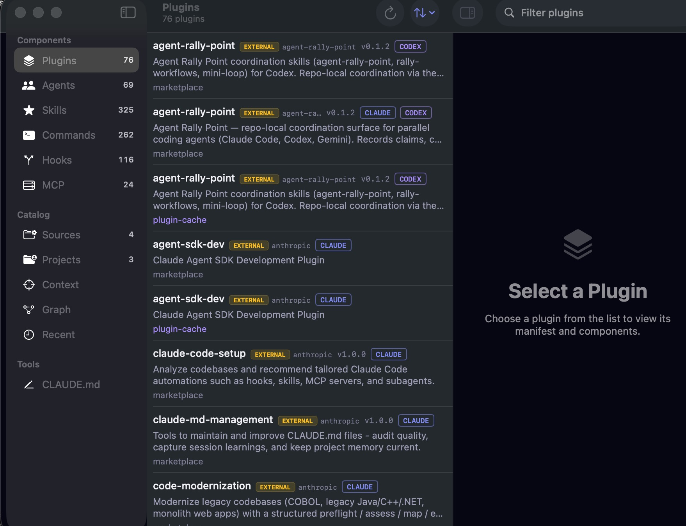
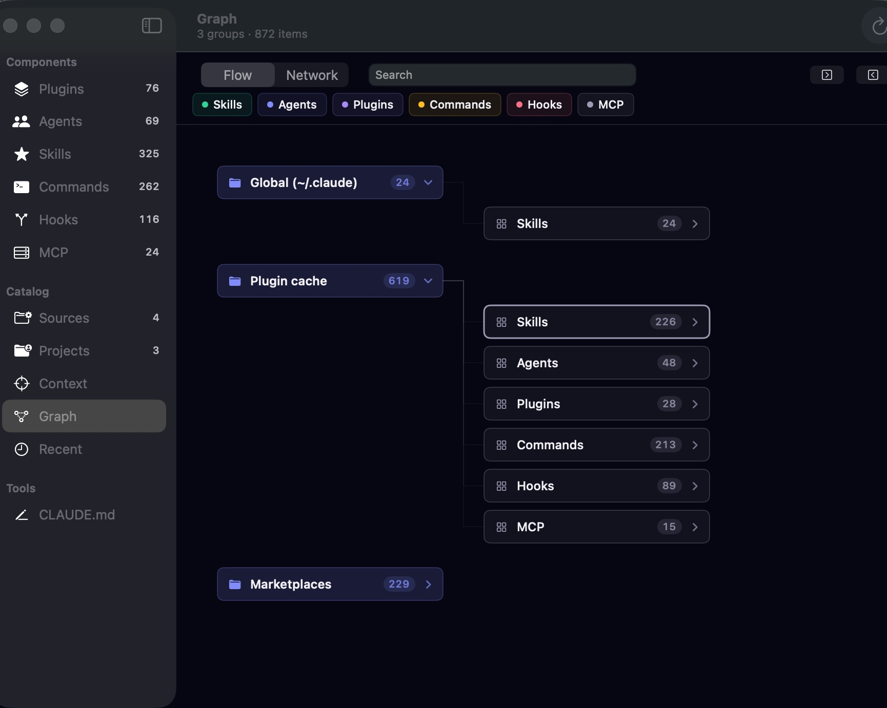
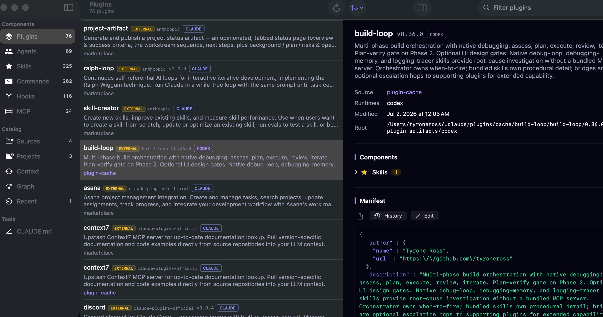

# Agent Astronomer

**See, edit, and share everything in your Claude Code / Codex setup — from one native Mac app.**

Download the latest build → **[Releases](../../releases/latest)**

---

## The problem

If you use Claude Code (or Codex), your machine quietly fills up with **hundreds** of
skills, agents, plugins, commands, hooks, and MCP servers — scattered across
`~/.claude`, plugin caches, and marketplaces. In practice that means:

- **You can't see what you have.** No single view of every skill/agent/plugin, or which
  ones are yours vs. installed from a marketplace.
- **You don't know what a plugin actually contains.** A plugin is a black box — which
  skills, agents, and commands ship inside it?
- **Editing is risky.** Tweaking a skill means hunting for the file and editing in place,
  with nothing to fall back to.
- **Sharing your setup is manual.** Handing an agent (and the skills it needs) to a
  teammate means zipping files by hand.

## What Agent Astronomer does

A **local-first, native macOS app** that reads your filesystem directly — **no cloud, no
account, no server, nothing to sign into.** It indexes what's already on your machine and
gives you one place to browse, understand, edit, and share it.

- **See everything in one window** — plugins, agents, skills, commands, hooks, MCP
  servers, and `CLAUDE.md` files, grouped by source (Global, plugin cache, marketplaces).
- **Understand any plugin** — select it to see the actual skills / agents / commands /
  hooks / MCP servers that comprise it, not just a name.
- **Two-axis clarity** — every item shows its **source** (`MINE` vs `EXTERNAL` + vendor)
  and its **runtime** (`CLAUDE`, `CODEX`, or both), so you always know what it is and
  where it runs.
- **Toggle plugins per host** — enable or disable any plugin independently on
  **Claude Code** and **Codex** from one view; a plugin can be on for one and off for
  the other. Changes write straight to your live configs — safely, with a backup and
  one-click undo.
- **Edit safely, archive-first** — every edit snapshots the original before writing in
  place, so traces, connections, and dependencies survive. Full version history included.
- **Import anything** — register a local folder, clone a GitHub repo, or paste a
  skill/agent as text.
- **Export to share** — bundle an agent (plus the skills it references), a skill, or a
  whole plugin into a folder — zipped automatically when it's large.

## Install

1. Download the `.dmg` from **[Releases](../../releases/latest)**, open it, and drag
   **Agent Astronomer** into Applications.
2. Launch it — signed with Developer ID and **notarized by Apple**, so it opens with
   no Gatekeeper warning.
3. It scans your machine automatically. No configuration required.

**Requirements:** macOS 14 (Sonoma) or later · Apple Silicon.

## Privacy

Everything stays on your Mac. Agent Astronomer reads your local Claude Code / Codex files
and writes only its own state under `~/.astronomer/`. It makes no network calls except when
you explicitly clone a GitHub repo via **Add Project**.

## License

Apache-2.0. The application source is maintained privately; this repository distributes the
released binaries only.
